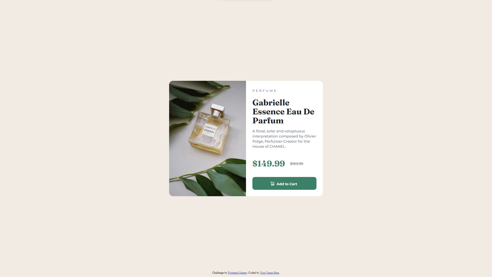

# Frontend Mentor - Product preview card component solution

This is a solution to the [Product preview card component challenge on Frontend Mentor](https://www.frontendmentor.io/challenges/product-preview-card-component-GO7UmttRfa). Frontend Mentor challenges help you improve your coding skills by building realistic projects.

## Table of contents

- [Overview](#overview)
  - [The challenge](#the-challenge)
  - [Screenshot](#screenshot)
  - [Links](#links)
  - [Built with](#built-with)
  - [What I learned](#what-i-learned)
  - [Continued development](#continued-development)
- [Author](#author)

## Overview

This is my first experience with Frontend Mentor.

## The challenge

- View the optimal layout depending on their device's screen size
- See hover and focus states for interactive elements

### Screenshot

### Links

- Live Site URL: [Vercel App](https://product-preview-card-component-main-iota-three.vercel.app/)

### Built with

- Semantic HTML5 markup
- CSS custom properties
- Mobile-first workflow
- Blood and tears

### What I learned

I learned how to style elements and the most annoying part of CSS CENTERING THINGS.

### Continued development

Next up I will study Tailwind CSS and a little bit of SASS for the design part and I'm planning on using React or Next.js from now on.

## Author

- Website - [RXBL4D3](https://www.your-site.com)
- Frontend Mentor - [@RXBlade](https://www.frontendmentor.io/profile/RXBlade)
